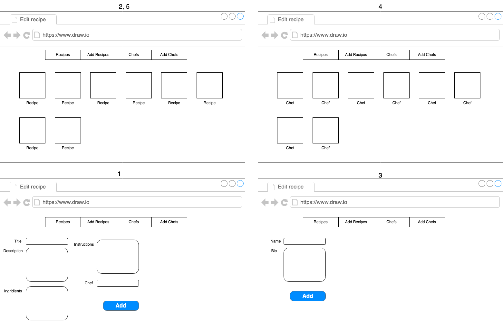

**Név**: Váradi Richárd Tamás
**Neptun**: XA5OZH

Az elképzelt feladat egy recept megosztó platform, ahol séfek szerint lehet recepteket keresni.

## Enitánsok

**Recept**:
- **Attribútumok**
	- Cím
	- Leírás
	- Hozzávalók
	- Utasítások
	- Séf
- **Műveletek**
	- Létrehozás
	- Olvasás
	- Frissítés
	- Törlés

**Séf**
- **Attribútumok**
	- Név
	- Bio
- **Műveletek**
	- Létrehozás
	- Olvasás
	- Frissítés
	- Törlés

## Nézetek
1. Recept létrehozó és szerkesztő nézet
2. Recept böngésző nézet
3. Séf létrehozó és szerkesztő nézet
4. Séf böngésző nézet
5. Séfek receptjei nézet

## Technológia

- Node.js
- Express.js
- MongoDB
- HTML, CSS, JavaScript
- React
## API

- /api/recipes/:
	- POST /api/recipes - Új recept létrehozás
	- GET /api/recipes/:id - Recept olvasása ID alapján
	- PUT /api/recipes/:id - Recept frissítése ID alapján
	- DELETE /api/recipes/:id - Recept törlése ID alapján
	- GET /api/recipes - Receptek listázása
	- GET /api/recipes?chef=id - Receptek listázása séf szerint
- /api/chefs
	- POST /api/chefs - Új séf profil létrehozása
	- GET /api/chefs/:id - Séf lekérdezése ID alapján
	- PUT /api/chefs/:id - Séf frissítése ID alapján
	- DELETE /api/chefs/:id - Séf törlése ID alapján
	- GET /api/chefs - Séfek listázása
